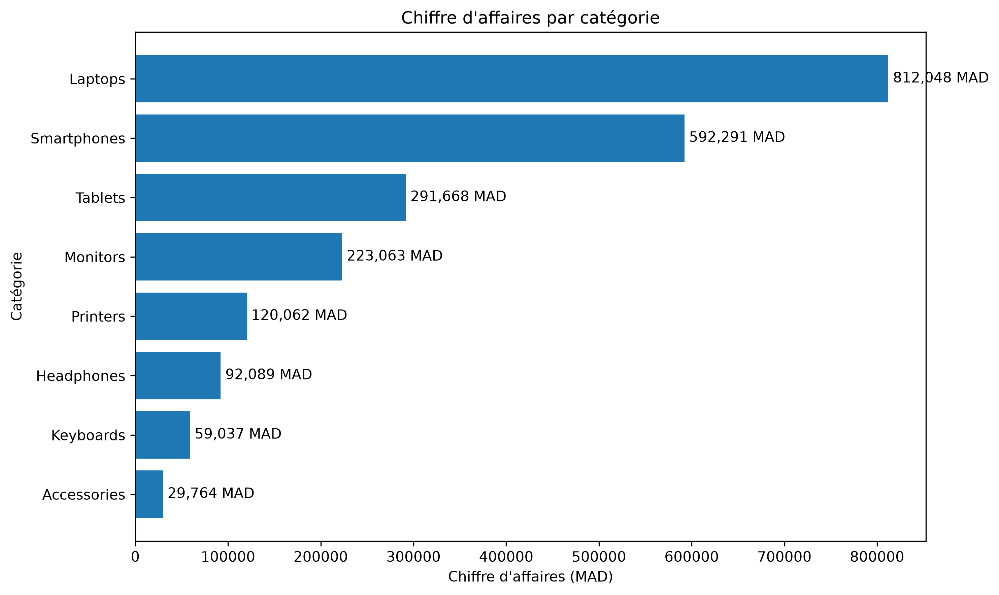
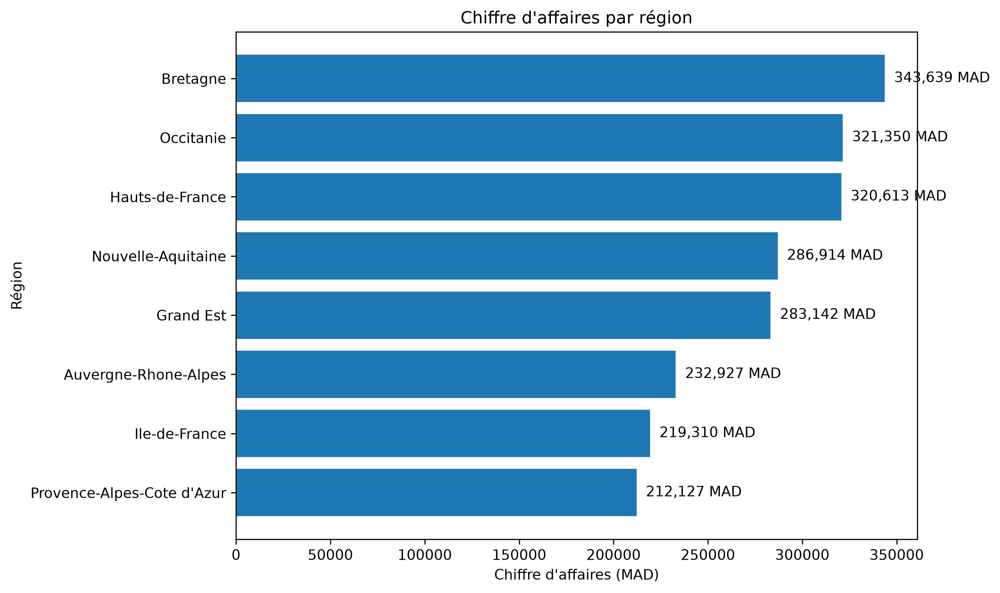
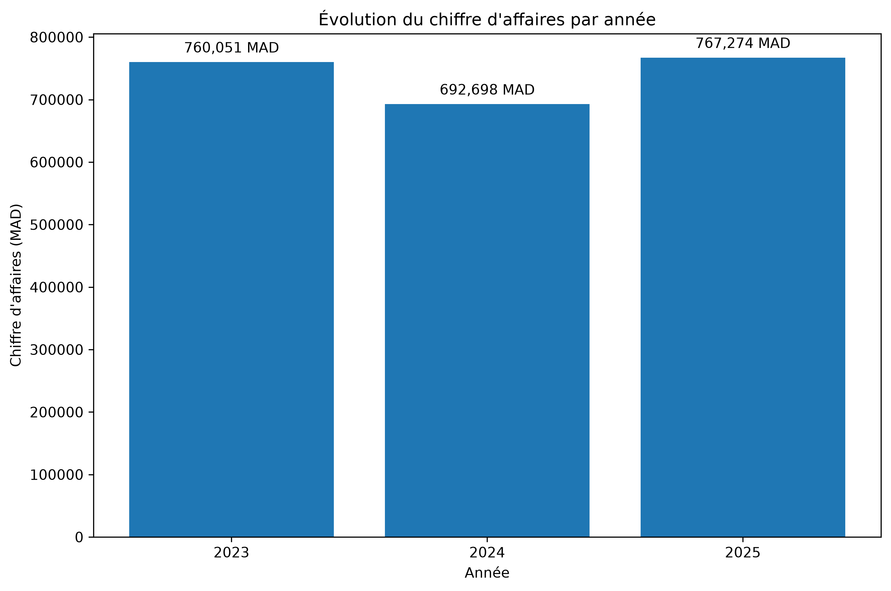
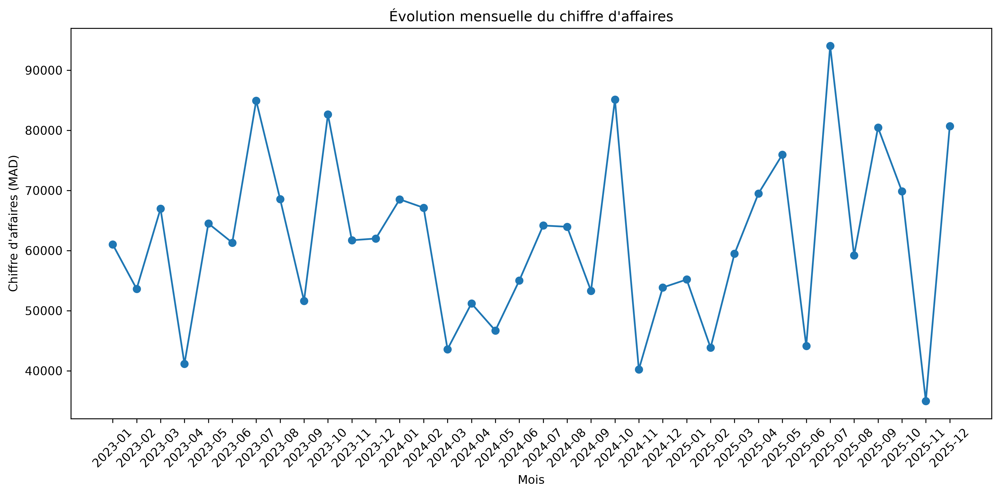
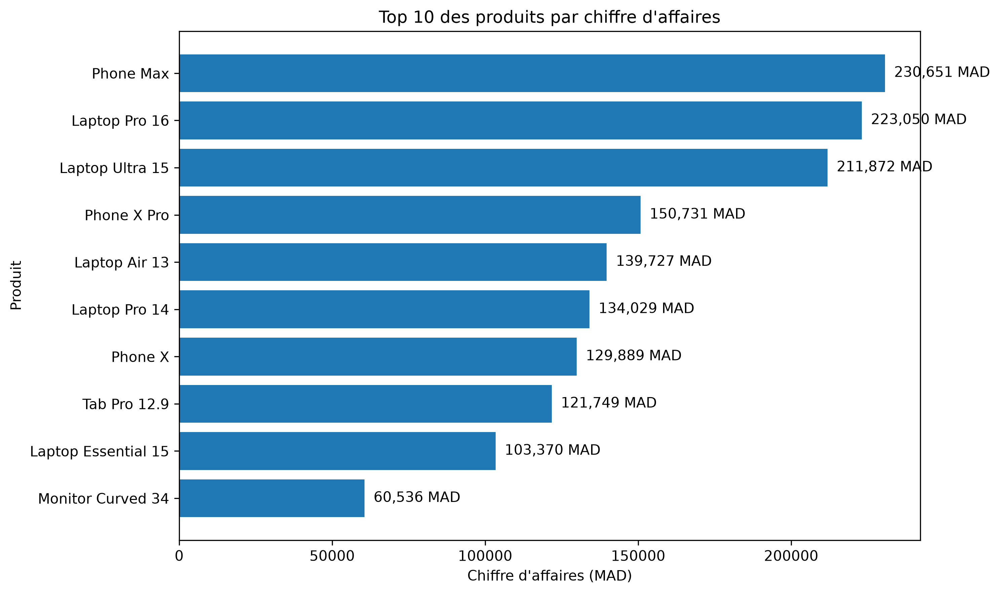
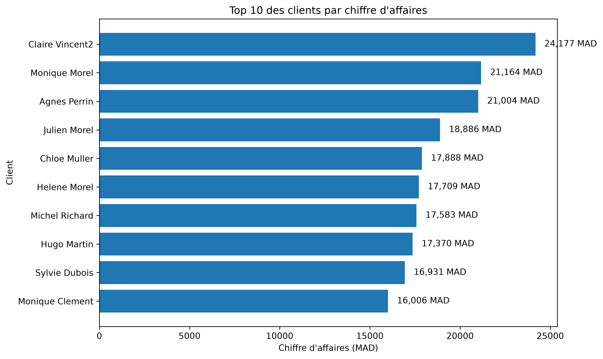
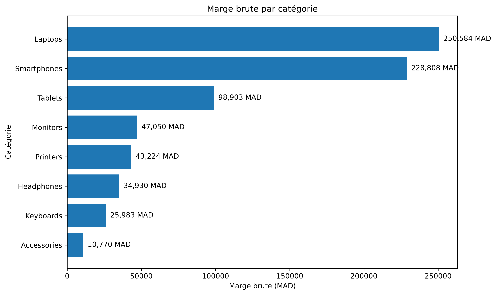

# 📊 E-commerce Sales & Customer Analysis — MySQL, Docker & Python

Analyse complète des ventes et des clients d'une plateforme e-commerce à l'aide de **MySQL**, **SQL**, **Docker**, **Python**, **Pandas** et **Matplotlib**.

Le projet couvre l'ensemble du processus d'analyse :

**Génération des données → Modélisation MySQL → Qualité des données → Analyse SQL → KPI → Analyses avancées → Visualisations Python → GitHub**

---

## 🎯 Objectifs du projet

Ce projet a pour objectif de construire une analyse complète d'une base de données e-commerce afin de répondre à plusieurs questions métier :

- Quel est le chiffre d'affaires total ?
- Quelles sont les catégories les plus performantes ?
- Quels sont les produits qui génèrent le plus de chiffre d'affaires ?
- Quels sont les meilleurs clients ?
- Quelles régions génèrent le plus de revenus ?
- Comment évoluent les ventes dans le temps ?
- Quelle est la marge brute par catégorie ?
- Quels clients n'ont jamais effectué de commande ?
- Quels produits n'ont jamais été vendus ?
- Comment identifier les tendances et performances commerciales ?

Le projet permet également de mettre en pratique des techniques SQL avancées :

- `JOIN`
- `GROUP BY`
- `HAVING`
- sous-requêtes
- `CTE`
- fonctions de fenêtre
- `RANK`
- `DENSE_RANK`
- `ROW_NUMBER`
- `LAG`
- `LEAD`
- agrégations
- création de `VIEW`

---

## 🛠️ Technologies utilisées

### Base de données

- MySQL
- SQL
- MySQL Workbench
- MySQL Connector/Python

### Conteneurisation

- Docker
- Docker Compose

### Analyse et visualisation

- Python 3.13
- Pandas
- Matplotlib
- SQLAlchemy
- python-dotenv

### Développement

- Visual Studio Code
- Git
- GitHub

---

## 🗂️ Structure du projet

```text
ecommerce-mysql-analysis/
│
├── python/
│   ├── generate_data.py
│   └── visualize_data.py
│
├── results/
│   ├── margin_by_category.png
│   ├── revenue_by_category.png
│   ├── revenue_by_month.png
│   ├── revenue_by_region.png
│   ├── revenue_by_year.png
│   ├── top_10_customers.png
│   └── top_10_products.png
│
├── sql/
│   ├── 01_create_database.sql
│   ├── 02_create_tables.sql
│   ├── 03_insert_data.sql
│   ├── 04_data_quality.sql
│   ├── 05_basic_analysis.sql
│   ├── 06_join_analysis.sql
│   ├── 07_kpi.sql
│   ├── 08_product_analysis.sql
│   ├── 09_region_analysis.sql
│   ├── 10_time_analysis.sql
│   ├── 11_customer_analysis.sql
│   ├── 12_subqueries.sql
│   ├── 13_cte_analysis.sql
│   ├── 14_window_functions.sql
│   └── 15_views.sql
│
├── .env.example
├── .gitignore
├── docker-compose.yml
└── README.md
```

> Le fichier `.env` contenant les informations de connexion locales n'est pas publié sur GitHub.

---

## 🐳 Docker & MySQL

La base de données MySQL est exécutée dans un conteneur Docker.

Le projet utilise Docker Compose pour démarrer MySQL avec :

- un serveur MySQL ;
- le port `3306` ;
- la base de données `ecommerce_analysis` ;
- un volume persistant pour les données.

Démarrage :

```bash
docker compose up -d
```

Vérification :

```bash
docker ps
```

---

## 🔐 Configuration des variables d'environnement

Les informations de connexion sont stockées localement dans un fichier `.env`.

Exemple :

```env
MYSQL_HOST=127.0.0.1
MYSQL_PORT=3306
MYSQL_USER=root
MYSQL_PASSWORD=YOUR_PASSWORD
MYSQL_DATABASE=ecommerce_analysis
```

Le fichier `.env` est ignoré par Git grâce au `.gitignore`.

Un fichier `.env.example` est fourni dans le repository avec des valeurs génériques.

---

## ⚡ Quick Start

```bash
git clone https://github.com/JihadKeraoui/ecommerce-mysql-analysis.git
cd ecommerce-mysql-analysis
docker compose up -d
```

Puis :

1. Configurer le fichier `.env`.
2. Ouvrir MySQL Workbench.
3. Se connecter au serveur MySQL.
4. Exécuter les scripts SQL dans l'ordre.
5. Installer les dépendances Python.
6. Exécuter le script de visualisation.

Installation des dépendances :

```bash
python -m pip install pandas matplotlib mysql-connector-python python-dotenv sqlalchemy
```

Exécution des visualisations :

```bash
python python/visualize_data.py
```

Les graphiques sont générés dans le dossier `results/`.

---

## 🗄️ Création et alimentation de la base

Les scripts SQL sont organisés dans un ordre logique.

### 01 — Création de la base

```text
sql/01_create_database.sql
```

Création de la base :

```text
ecommerce_analysis
```

avec l'encodage `utf8mb4`.

### 02 — Création des tables

```text
sql/02_create_tables.sql
```

Tables principales :

- `categories`
- `customers`
- `products`
- `orders`
- `order_items`
- `payments`

Les relations sont définies avec des clés primaires et étrangères.

### 03 — Insertion des données

```text
sql/03_insert_data.sql
```

Insertion du jeu de données e-commerce.

---

## 📦 Volume des données

| Table | Nombre de lignes |
|---|---:|
| Categories | 8 |
| Products | 40 |
| Customers | 750 |
| Orders | 1 000 |
| Order items | 2 510 |
| Payments | 910 |

Le jeu de données permet d'analyser les ventes, les clients, les produits, les catégories, les régions et les paiements.

---

## 🔎 Qualité des données

Le script :

```text
sql/04_data_quality.sql
```

contrôle notamment :

- les clients sans adresse e-mail ;
- les doublons d'e-mails ;
- les prix invalides ;
- les quantités invalides ;
- les commandes orphelines ;
- les lignes de commandes orphelines ;
- les incohérences de montants de paiement.

Le jeu de données contient volontairement certaines anomalies afin de tester les contrôles de qualité.

---

# 📈 Analyses SQL

## 05 — Analyse de base

```text
sql/05_basic_analysis.sql
```

Principaux résultats :

| Indicateur | Résultat |
|---|---:|
| Clients | 750 |
| Commandes | 1 000 |
| Produits | 40 |
| Chiffre d'affaires | 2 220 022,87 MAD |
| Unités vendues | 5 064 |

Panier moyen :

**≈ 2 220,02 MAD**

---

## 06 — Analyses avec JOIN

```text
sql/06_join_analysis.sql
```

Cette étape analyse :

- les meilleurs clients ;
- le chiffre d'affaires par catégorie ;
- les meilleurs produits ;
- le chiffre d'affaires par région.

### Chiffre d'affaires par catégorie

| Catégorie | CA |
|---|---:|
| Laptops | 812 048,35 MAD |
| Smartphones | 592 291,27 MAD |
| Tablets | 291 668,16 MAD |
| Monitors | 223 062,89 MAD |
| Printers | 120 062,39 MAD |
| Headphones | 92 088,74 MAD |
| Keyboards | 59 036,69 MAD |
| Accessories | 29 764,38 MAD |

Les **Laptops** représentent la catégorie avec le chiffre d'affaires le plus élevé.

---

## 📊 07 — KPI commerciaux

```text
sql/07_kpi.sql
```

Le script regroupe plusieurs indicateurs de performance :

- chiffre d'affaires ;
- nombre de commandes ;
- unités vendues ;
- panier moyen ;
- clients ;
- marge brute ;
- taux de marge.

Chiffre d'affaires total :

**2 220 022,87 MAD**

Marge brute totale :

**≈ 740 252 MAD**

Taux de marge global :

**≈ 33,34 %**

---

## 🏆 08 — Analyse des produits

```text
sql/08_product_analysis.sql
```

Analyses réalisées :

- produits avec le plus gros chiffre d'affaires ;
- produits les plus vendus en volume ;
- produits avec les plus faibles performances ;
- marge par catégorie ;
- taux de marge par catégorie.

Le produit générant le plus de chiffre d'affaires est :

**Phone Max — ≈ 230 650,92 MAD**

---

## 🌍 09 — Analyse régionale

```text
sql/09_region_analysis.sql
```

Analyses :

- CA par région ;
- nombre de clients ;
- nombre de commandes ;
- unités vendues ;
- panier moyen ;
- marge ;
- taux de marge ;
- classement des régions ;
- part de chaque région dans le CA.

### Classement par chiffre d'affaires

| Région | CA |
|---|---:|
| Bretagne | 343 639,41 MAD |
| Occitanie | 321 350,48 MAD |
| Hauts-de-France | 320 612,75 MAD |
| Nouvelle-Aquitaine | 286 914,33 MAD |
| Grand Est | 283 141,69 MAD |
| Auvergne-Rhône-Alpes | 232 926,88 MAD |
| Île-de-France | 219 310,17 MAD |
| Provence-Alpes-Côte d'Azur | 212 127,16 MAD |

La **Bretagne** est la région générant le chiffre d'affaires le plus élevé.

---

## 📅 10 — Analyse temporelle

```text
sql/10_time_analysis.sql
```

Analyses :

- CA annuel ;
- CA trimestriel ;
- CA mensuel ;
- classement des périodes ;
- panier moyen mensuel.

### CA annuel

| Année | CA |
|---|---:|
| 2023 | 760 050,77 MAD |
| 2024 | 692 697,79 MAD |
| 2025 | 767 274,31 MAD |

L'année 2024 présente une baisse par rapport à 2023, tandis que 2025 montre un rebond.

---

## 👥 11 — Analyse des clients

```text
sql/11_customer_analysis.sql
```

Analyses :

- meilleurs clients ;
- commandes par client ;
- CA par client ;
- panier moyen ;
- clients actifs ;
- clients inactifs.

---

## 🔍 12 — Sous-requêtes

```text
sql/12_subqueries.sql
```

Utilisation de sous-requêtes pour réaliser des analyses comparatives et identifier notamment :

- les clients au-dessus de la moyenne ;
- les produits dépassant certains seuils ;
- les produits sans ventes.

---

## 🧩 13 — CTE

```text
sql/13_cte_analysis.sql
```

Utilisation des `Common Table Expressions` avec `WITH` pour construire des analyses SQL lisibles et réutilisables.

Analyses notamment réalisées :

- CA client comparé à la moyenne ;
- évolution mensuelle ;
- comparaison avec le mois précédent ;
- contribution des catégories.

---

## 📊 14 — Window Functions

```text
sql/14_window_functions.sql
```

Fonctions utilisées :

- `RANK()`
- `DENSE_RANK()`
- `ROW_NUMBER()`
- `LAG()`
- `LEAD()`
- `NTILE()`
- `FIRST_VALUE()`
- sommes cumulées ;
- moyennes mobiles.

---

## 👁️ 15 — Views

```text
sql/15_views.sql
```

Création des vues analytiques :

```text
vw_customer_revenue
vw_product_performance
vw_monthly_revenue
vw_region_kpi
```

Ces vues permettent de réutiliser facilement les résultats analytiques.

---

# 🐍 Analyse et visualisation avec Python

Le script :

```text
python/visualize_data.py
```

se connecte à MySQL et récupère les données nécessaires aux visualisations.

Bibliothèques utilisées :

- Pandas ;
- MySQL Connector ;
- SQLAlchemy ;
- Matplotlib ;
- python-dotenv.

---

# 📊 Visualisations réalisées

Le projet contient actuellement **7 visualisations**.

## 1. Chiffre d'affaires par catégorie



---

## 2. Chiffre d'affaires par région



---

## 3. Chiffre d'affaires par année



---

## 4. Évolution mensuelle du chiffre d'affaires



---

## 5. Top 10 des produits



---

## 6. Top 10 des clients



---

## 7. Marge brute par catégorie



---

# 💡 Principaux insights

L'analyse permet notamment de constater que :

- les **Laptops** génèrent le chiffre d'affaires le plus élevé ;
- les **Smartphones** représentent également une catégorie majeure ;
- la **Bretagne** est la première région en chiffre d'affaires ;
- le chiffre d'affaires baisse en 2024 avant de rebondir en 2025 ;
- le chiffre d'affaires mensuel présente une forte variabilité ;
- **Phone Max** est le produit générant le plus de CA ;
- les **Laptops** génèrent la marge brute totale la plus importante ;
- les **Keyboards** présentent le meilleur taux de marge parmi les catégories analysées ;
- la marge brute globale est d'environ **740 252 MAD** ;
- le taux de marge global est d'environ **33,34 %**.

---

# 📊 Dashboard

Les visualisations actuelles sont générées avec **Python, Pandas et Matplotlib**.

Une évolution possible du projet consiste à créer un dashboard interactif avec **Power BI** regroupant :

- les KPI principaux ;
- le chiffre d'affaires ;
- l'évolution temporelle ;
- les performances par catégorie ;
- les performances par région ;
- les produits les plus performants ;
- les meilleurs clients ;
- les indicateurs de marge.

Le dashboard Power BI n'est pas encore intégré au projet actuel.

---

# 🧠 Compétences développées

## SQL

- SELECT
- WHERE
- GROUP BY
- HAVING
- ORDER BY
- JOIN
- LEFT JOIN
- sous-requêtes
- `NOT EXISTS`
- fonctions d'agrégation
- CTE
- Window Functions
- `RANK`
- `DENSE_RANK`
- `ROW_NUMBER`
- `LAG`
- `LEAD`
- `NTILE`
- `FIRST_VALUE`
- Views
- Data Quality
- KPI

## Data Analysis

- analyse des ventes ;
- analyse des clients ;
- analyse des produits ;
- analyse géographique ;
- analyse temporelle ;
- analyse de la marge ;
- calcul des KPI ;
- contrôle de la qualité des données ;
- interprétation des résultats.

## Python

- connexion à MySQL ;
- Pandas ;
- DataFrame ;
- SQLAlchemy ;
- gestion des variables d'environnement ;
- Matplotlib ;
- génération automatisée de graphiques.

## Technologies

- MySQL
- Docker
- Docker Compose
- Python
- Pandas
- Matplotlib
- SQLAlchemy
- Visual Studio Code
- Git
- GitHub

---

# 🔐 Sécurité

Les informations sensibles ne doivent jamais être publiées dans le repository.

Le fichier :

```text
.env
```

contient les informations de connexion locales et est exclu de Git.

Le fichier :

```text
.env.example
```

est fourni avec des valeurs génériques.

Aucun mot de passe réel ne doit être présent dans le repository.

---

# 🚀 Évolutions possibles

Le projet actuel couvre le processus complet d'analyse, de la préparation des données jusqu'aux visualisations.

Améliorations possibles :

1. Créer un dashboard interactif avec Power BI.
2. Ajouter des KPI commerciaux supplémentaires.
3. Approfondir l'analyse de la marge par produit et par région.
4. Ajouter une segmentation des clients.
5. Ajouter une analyse RFM.
6. Ajouter une analyse prédictive des ventes.
7. Automatiser l'actualisation des données.
8. Ajouter des tests automatisés de qualité des données.
9. Mettre en place une pipeline ETL complète.

---

# 📌 Résumé du projet

```text
                  DONNÉES E-COMMERCE
                         │
                         ▼
                  Génération Python
                         │
                         ▼
                    MySQL / Docker
                         │
                         ▼
                  Data Quality
                         │
                         ▼
                   Analyse SQL
                         │
          ┌──────────────┼──────────────┐
          ▼              ▼              ▼
         KPI            CTE       Window Functions
          │              │              │
          └──────────────┼──────────────┘
                         ▼
                       Views
                         │
                         ▼
                  Python / Pandas
                         │
                         ▼
                     Matplotlib
                         │
                         ▼
                  7 Visualisations
                         │
                         ▼
                       GitHub
```

---

# 👤 Auteur

**Jihad Keraoui**

Projet réalisé dans le cadre de la constitution d'un portfolio personnel en **Data Analysis / Data Engineering**.

🔗 GitHub :

https://github.com/JihadKeraoui
